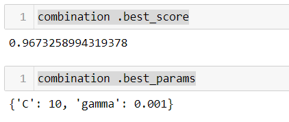

# fastDStool
-	Preprocessing
 
Parameters: 
fill_nan : Dictionary, The key is "replace" ans "fill_nan". Default = None.
The value for each key can also dictionary and fill values for each column.
Change specific data to nan value and fill it with fill value.

Ex) fill_nan = {"replace":{"0":np.nan},"fill_nan" : {"Weight":"mean"}

encoders: Dictionary, key is encoded feature name, value is encoders. Default = None.
Apply encoder to the data.

Ex) encoders = { “f_name1” : OneHotEncoder(), “f_name2”: LableEncoder() }

scalers: A list of various scaler. Default = None.
Apply scaler to the data using loop statement.

Ex) scalers = [StandardScaler(), MinMaxScaler(), MaxAbsScaler(), RobustScaler()]

outliers: Dictionary, the key is categorical or numerical, the value is upper, lower bound.
"categorical"'s value is dictionary, "numerical"'s value is also dictionary, and key is feature name, value is list of upper,lower bound.
	   
Ex) outliers = { “categorical” : {“f_name1”:”Z”}, “numerical” : {“f_name2” : [100,0] } }

-	Model building & Testing

Parameters: 
predictor_names : List of names of predictor features.
Ex ) predictor_names  = data.columns[:-1]

target_name: name of the target column
Ex) target_name = data.columns[-1]

test_size : test size to separate train and test.
Ex) test_size = 0.3

models : A list of various models.
Ex) models = [DecisionTreeClassifier(),LogisticRegression(),GaussianNB()]

   params : A list of model hyper paremeters.
   Ex) params = [{"criterion" : ["gini", "entropy"],"max_depth": [5, 10, 20]} ]

k_fold : A list of k values.
Ex) K_fold = [3,5]

- Finding the best result.

There are no parameters and return the scores and parameters of the model with the highest score among the generated models.

Example #1

    combination  = DS(data.copy(),data.columns[:-1],data.columns[-1],0.3,
                  scalers = [StandardScaler(),MinMaxScaler(),MaxAbsScaler(),RobustScaler()],
                 
                  fill_nan = {"replace":{"?":np.nan},"fill_nan" : {"Bare Nuclei":"mean"}},
                  models = [DecisionTreeClassifier(),LogisticRegression(),SVC()],
                  params = [{"criterion" : ["gini", "entropy"],"max_depth": [5, 10, 20]},
                  {"penalty" : ['l1', 'l2', 'elasticnet', 'none'],
                   "C":[0.001,0.01,0.1,1,10,100],
                  "solver" : ['newton-cg', 'lbfgs', 'liblinear', 'sag', 'saga']},
                  {"C":[0.001,0.01,0.1,1,10,100],"gamma":[0.001,0.01,0.1,1,10,100]}],
                 k_fold = [3,5]

      
       )

    combination.preprocessing()

    combination.build_test_models(10)

    combination .find_best()

    combination .best_score

    combination .best_params
    

  Example 2 (simpler way)

    combination  = DS(data.copy(),data.columns[:-1],data.columns[-1],0.3,
                  scalers = [StandardScaler(),MinMaxScaler(),MaxAbsScaler(),RobustScaler()],
                  fill_nan = {"replace":{"?":np.nan},"fill_nan" : {"Bare Nuclei":"mean"}},
                  models = [DecisionTreeClassifier(),LogisticRegression(),SVC()],
                  params = [{"criterion" : ["gini", "entropy"],"max_depth": [5, 10, 20]},
                  {"penalty" : ['l1', 'l2', 'elasticnet', 'none'],
                   "C":[0.001,0.01,0.1,1,10,100],
                  "solver" : ['newton-cg', 'lbfgs', 'liblinear', 'sag', 'saga']},
                  {"C":[0.001,0.01,0.1,1,10,100],"gamma":[0.001,0.01,0.1,1,10,100]}],
                 k_fold = [3,5]

      
       )

    combination.run(200)
    combination .best_score
    combination .best_params

The result of Example

